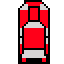
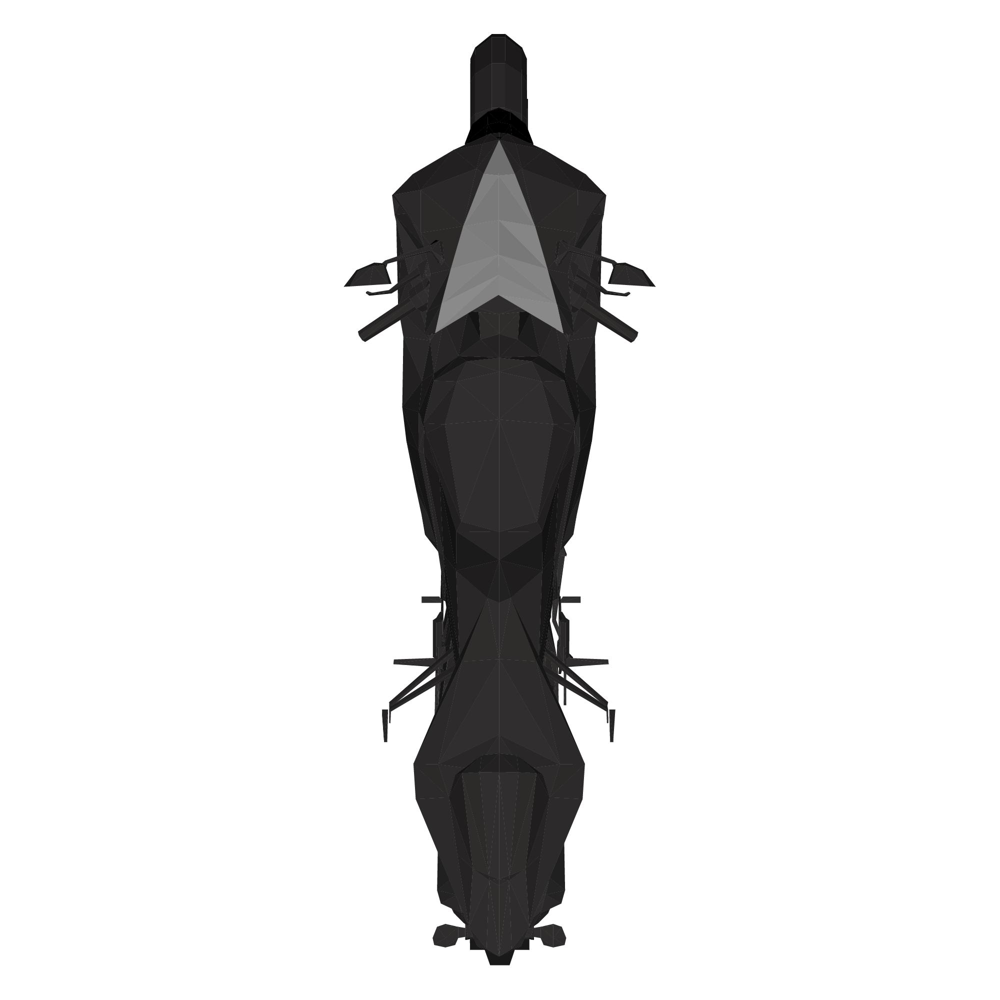
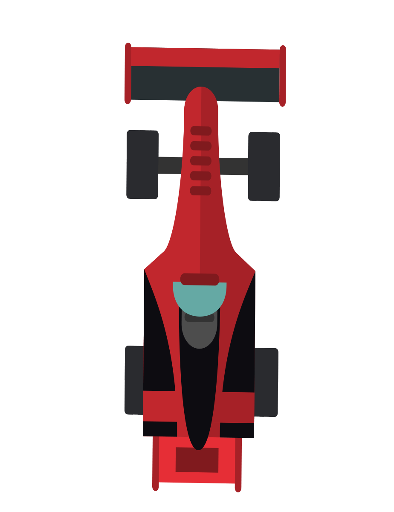
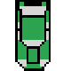

    
<strong>Họ và tên:</strong> Nguyễn Phúc Thành

    
<strong>Mã số sinh viên:</strong> 24021629

    
<strong>Lớp:</strong> K69I-CS1

  

  <h1>🎮 Game: Car racing 🚗</h1>
  

    <h2> Giới thiệu</h2>
    
<strong>Space Shooter</strong> Đây là trò chơi đua xe vượt chướng ngại vật đơn giản được xây dựng bằng C++ và thư viện SDL2. Người chơi điều khuyển 1 trong 3 loại xe ô tô, xe gắn máy, xe đua để tham gia trò chơi. Trò chơi có hình ảnh sinh động, cơ chế điều khuyển linh hoạt và hệ thống tính điểm .

  

  
<strong>Luật chơi:</strong>

  <ul>
    <li>Xe sẽ chạy trên 4 làn đường.</li>
    <li>Chướng ngại vật xuất hiện ngẫu nhiên ở mỗi làn.</li>
    <li>Sau mỗi một khoảng thời gian, độ khó tăng lên (bằng cách giảm thời gian sinh chướng ngại).</li>
    <li>Người chơi có thể thu thập phần thưởng (ví dụ như ngôi sao) để tăng điểm.</li>
    <li>Người chơi có thể chọn 1 trong 3 loại xe trong phần option bằng các nút ← → và chọn bằng <b>enter</b> </li>
  </ul>

  
<strong>Cách điều khiển:</strong>

  <ul>
    <li>←: Sang trái</li>
    <li>→: Sang phải</li>
    <li>↑: Tiến lên</li>
    <li>↓: Lùi xuống</li>
    </ul>

  <h2>🔧 Kỹ thuật và bố trí</h2>
  <ul>
      <li> Ngôn ngữ: C++</li>
      <li> Thư viện: SDL2</li>
      <li> Quản lý cuộn nền: dùng scrolly để tạo hiệu ứng đường chạy đơn giản</li>
      <li> Hình ảnh xe chính và chướng ngại được chọn từ trong tệp <code>img/</code> </li>
          
 Hình ảnh chính: được chọn một trong 3 loại xe có sẵn trong tệp 

          
          
          
          
 Hình ảnh vật cản: thay phiên nhau dùng 3 hình có sẵn trong file

          
          
          
      <li> Âm nhạc: sử dụng âm thanh có sẵn trên ytb phù hợp với khung cảnh biển và động cơ xe</li>
  </ul>

  <h2>🎯Thuật toán sử dụng trong trò chơi</h2>
      <ul>
        <li>Thuật toán sinh obstacle: Game sẽ tạo ngẫu nhiên 1–3 chướng ngại vật sau một khoảng thời gian(spawnInterval), sau khi sinh ít nhất một chướng ngại, phần thưởng (Reward) sẽ được tạo ra phía sau một trong các xe. Các xe sẽ sinh ở 1 trong 4 làn(shuffleLanes(lanes, 4);) </li>
        <li>Xử lý va chạm: sử dụng cách thức phổ thông để xác định khoảng cách va chạm. Bằng cách tính theo trục x và y giữa 2 xe, rồi so sánh với ngưỡng nhỏ hơn chiều rộng làn đường và chiều cao xe để xác định xem hai đối tượng có chồng lên nhau không. Nếu xác định va chạm, biến <b>collided = true</b>.</li>  
      </ul>
